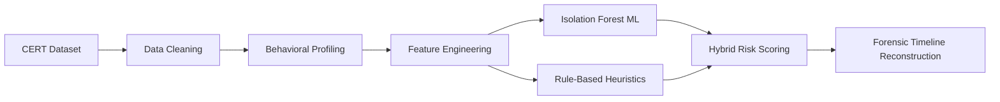

# 🕵️‍♂️ Hybrid Insider Threat Detection System

[](https://www.python.org/downloads/)
[](#)
[](#)
[](https://opensource.org/licenses/MIT)

An end-to-end data forensics and behavioral analysis pipeline designed to detect malicious insider activity within enterprise environments. 

By combining **Rule-Based Heuristics** with **Unsupervised Machine Learning (Isolation Forest)**, this system analyzes over 15+ GB of simulated enterprise logs to identify data exfiltration, lateral movement, and suspicious behavioral deviations.

---

## 🌟 Key Highlights
* **Big Data Processing:** Engineered to handle massive datasets (14.5+ GB HTTP logs) using chunking and memory-efficient `pandas` pipelines.
* **Behavioral Profiling:** Extracts 15 unique behavioral features per user (e.g., after-hours logins, USB-to-file temporal correlations, external email attachments).
* **Hybrid Detection Engine:** Balances a proprietary 0-100 risk scoring algorithm (60% weight) with ML-based Isolation Forest anomaly scores (40% weight) to minimize false positives.
* **Forensic Evidence Chains:** Automatically reconstructs a chronological timeline of malicious events for high-risk users, making it easy for non-technical stakeholders to understand the threat.

---

## 🎯 Central Research Question
> *"Can behavioral patterns extracted from enterprise activity logs be used to identify anomalous user activity indicative of potential insider threats?"*

---

## 📊 The Dataset

This project utilizes the **CERT Insider Threat Dataset** from Carnegie Mellon University's Software Engineering Institute.

* **Download:** [CMU Figshare Repository](https://doi.org/10.1184/R1/12841247.v1) (Recommended: version `r4.2` or `r5.2`)

### Required Files
Place the following CSV files in the `data/raw/` directory:

| File | Description | Size (approx) |
|------|-------------|---------------|
| `logon.csv` | User login/logout events | 58 MB |
| `file.csv` | File access & modification operations | 193 MB |
| `email.csv` | Internal and external email activity | 1.3 GB |
| `http.csv` | Web browsing activity | 14.5 GB |
| `device.csv` | USB / removable device connection events | 28 MB |

---

## ⚙️ Setup & Installation

### 1. Clone the repository
```bash
git clone https://github.com/Puravgoyal/insider-threat-detection.git
cd insider-threat-detection
```

### 2. Install Dependencies
```bash
pip install -r requirements.txt
```

### 3. Run the Analysis
Launch the Jupyter Notebook to walk through the entire pipeline step-by-step:
```bash
jupyter notebook notebooks/insider_threat_analysis.ipynb
```

---

## 🧠 Methodology Pipeline



### Risk Level Thresholds
| Score | Threat Level | Action Required |
|-------|--------------|-----------------|
| `0–30`  | 🟢 **LOW** | Normal activity. No action required. |
| `31–60` | 🟡 **MEDIUM** | Slight deviation. Monitor for future spikes. |
| `61–80` | 🟠 **HIGH** | Suspicious. Trigger automated forensic timeline review. |
| `81–100`| 🔴 **CRITICAL**| Highly malicious. Immediate SOC intervention required. |

---

## 🔍 Key Behavioral Features Analyzed

1. **Temporal Anomalies:** After-hours login ratio, weekend login ratio, night activity ratio.
2. **Exfiltration Indicators:** USB connection frequency, USB-to-file temporal correlation, external emails with attachments.
3. **Lateral Movement:** Unique PC usage per user.
4. **Volume Spikes:** File access deviation score (identifying sudden mass-downloads).
5. **Web Traffic:** Connections to suspicious or unauthorized domains.

---

## 📁 Project Structure

```text
insider-threat-detection/
├── data/
│   ├── raw/                    # Place raw CERT CSV files here
│   └── processed/              # Cleaned datasets (auto-generated)
├── src/
│   ├── config.py               # Project constants, weights, & paths
│   ├── data_loader.py          # Handles chunked loading of 15GB files
│   ├── preprocessing.py        # Data cleaning & normalization
│   ├── baseline_profiling.py   # Establishes normal behavior baselines
│   ├── feature_engineering.py  # Extracts the 15 behavioral features
│   ├── anomaly_detection.py    # Scikit-Learn Isolation Forest implementation
│   ├── risk_scoring.py         # Hybrid rule + ML scoring engine
│   ├── forensic_investigation.py# Evidence chain timeline reconstruction
│   └── visualizations.py       # Matplotlib & Seaborn charting
├── notebooks/
│   └── insider_threat_analysis.ipynb   # Main interactive walkthrough
├── output/
│   ├── figures/                # Saved visualization PNGs (Activity, Heatmaps, etc.)
│   ├── reports/                # Generated forensic reports
│   └── risk_scores.csv         # Final computed risk score table
├── requirements.txt
└── README.md
```

---

## 🛠️ Tech Stack

* **Language:** Python 3.8+
* **Data Engineering:** Pandas, NumPy
* **Machine Learning:** Scikit-Learn (Isolation Forest)
* **Data Visualization:** Matplotlib, Seaborn
* **Environment:** Jupyter Notebook

---

## 📜 License & Disclaimer

This project is open-source under the MIT License. It was created for academic and educational purposes to demonstrate User Entity Behavior Analytics (UEBA) and Data Forensics. The CERT Insider Threat Dataset is provided by the CMU Software Engineering Institute under their respective terms of use.
